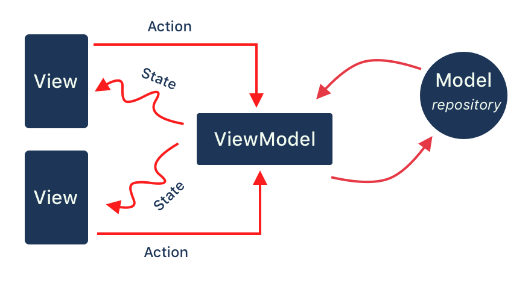

# Desafio Sicredi - Event App

## Sobre

Esta aplicação foi feita para o desafio da Sicred  que consiste em 3 objetivos:

- Criar uma aplicativo que consuma uma REST API e exiba uma listagem de eventos;
- Cada item da lista deve permitir acesso à detalhes do evento;
- No detalhe do evento é importante exibir suas informações e opções de check-in e compartilhamento.

## Telas

### 1. Lista de Eventos

Nesta tela são listados os eventos retornados da api, e são exibidas as informações do titulo, data e preço, além da imagem ser carregada se disponível. 

Caso o evento não possua uma imagem válida pra ser renderizada uma imagem padrão é renderizadas no lugar. A mesma imagem é usada enquanto as fotos estão sendo carregadas.

    

#### 1.1 Falha ao carregar eventos

Se por algum motivo não for possivel carregar a lista de eventos um Snackbar  alerta o usuário sobre a falha.

Caso não seja possivel carregar a lista de eventos ao entrar na aplicação ou caso a lista de eventos venha vazia uma mensagem é renderizada para o usuário.

      
    

### 2. Detalhes do evento

Nesta tela são exibidos os detalhes do evento, além de dar ao usuário a opção de compartilhar o evento e de realizar check-in.

#### 2.1 Compartilhar Eventos

Esta funcionalidade permite ao usuário compartilhar um convite para o evento.

    

#### 2.2. Checkin

Esta funcionalidade permite ao usuário realizar check-in no evento, exibindo uma mensagem de sucesso ou falha, baseado na resposta da api.

  
    
  

## Arquitetura

A arquitetura escolhida foi a MVVM com os [componentes do JetPack](https://developer.android.com/jetpack):

A arquitetura foi escolhida pois o time de desenvolvimeto android do google não somente recomenda como provê diversos recursos para facilitar a sua implementação, como [ViewModels](https://developer.android.com/topic/libraries/architecture/viewmodel), [LiveDatas](https://developer.android.com/topic/libraries/architecture/livedata), [DataBinding](https://developer.android.com/topic/libraries/data-binding) entre outros.

### Testes

Para a realização de testes foram utilizadas as bibliotecas [Junit](https://mvnrepository.com/artifact/junit/junit) e [mockito](https://github.com/mockito/mockito)

## Dependências

* [Retrofit](https://square.github.io/retrofit/) - Usada para realizar as chamadas http para a api.
* [Lottie](https://github.com/airbnb/lottie-android) - Usada para carregar as animações.
* [Koin ]((https://doc.insert-koin.io/#/))- Usada para realizar injeção de dependência.
* [Picasso](https://square.github.io/picasso/) - Usada para carregar as imagens. 